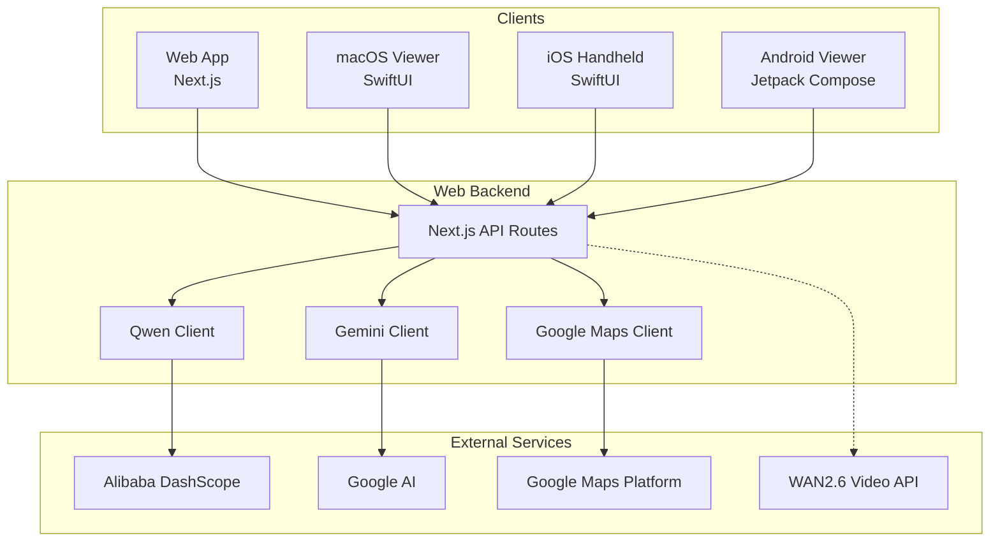

# toy-poodle-love

A multi-platform AI-powered route planning and scenario generation system.

> *The name "toy-poodle-love" comes from the WAN video generation example: "A cute toy poodle running in a sunny park"*

## Overview

**toy-poodle-love** is an end-to-end platform for AI-driven route optimization and scenario writing. It combines multiple AI services to generate tourist routes with narratives, and can even create videos from the generated scenarios.

### Key Capabilities

- **AI Text Generation** - Compare responses from Qwen (Alibaba) and Gemini (Google) models
- **Route Optimization** - Generate and optimize tourist routes using Google Maps APIs
- **Scenario Generation** - Create themed narratives for each location
- **Video Generation** - Transform scenarios into videos using WAN2.6 T2V/I2V models
- **Speech Integration** - Voice input and text-to-speech output

## Architecture



### Platform Overview

| Platform | Directory | Technology | Min Version |
|----------|-----------|------------|-------------|
| Web | `web/` | Next.js 16, React 19, TypeScript | Node.js 18+ |
| macOS | `viewer/` | Swift 6, SwiftUI | macOS 14.0+ |
| iOS | `handheld/` | Swift 5.9, SwiftUI | iOS 17.0+ |
| Android | `viewer-android/` | Kotlin, Jetpack Compose | Android 9 (API 28) |
| Video Gen | `wan2_6_i2v/` | Python 3.x | Python 3.8+ |

## Quick Start

### Prerequisites

- Node.js 18+
- API keys for:
  - [Alibaba DashScope](https://dashscope.console.aliyun.com/) (Qwen)
  - [Google AI Studio](https://makersuite.google.com/app/apikey) (Gemini)
  - [Google Cloud Console](https://console.cloud.google.com/) (Maps APIs)

### Web Application Setup

```bash
# Navigate to web directory
cd web

# Install dependencies
npm install

# Create environment file
cp .env.example .env
```

Edit `.env` with your API keys:

```env
QWEN_API_KEY=your_qwen_api_key
GEMINI_API_KEY=your_gemini_api_key
GOOGLE_MAPS_API_KEY=your_google_maps_api_key
```

```bash
# Start development server
npm run dev
```

Open [http://localhost:3000](http://localhost:3000) to access the web interface.

### macOS Viewer Setup

```bash
cd viewer

# Generate Xcode project (requires xcodegen)
xcodegen generate

# Open in Xcode
open viewer.xcodeproj
```

### iOS Handheld Setup

```bash
cd handheld

# Generate Xcode project
xcodegen generate

# Open in Xcode
open handheld.xcodeproj
```

### Android Viewer Setup

```bash
cd viewer-android

# Open in Android Studio or build via Gradle
./gradlew assembleDebug
```

### Video Generation (Python)

```bash
cd wan2_6_i2v

# Install dependencies
pip install -r requirements.txt

# Generate a video from text
python wan_video.py "A cute toy poodle running in a sunny park"
```

## API Reference

The web application exposes a RESTful API with the following endpoints:

| Category | Endpoint | Description |
|----------|----------|-------------|
| **AI** | `POST /api/qwen` | Call Qwen model |
| | `POST /api/gemini` | Call Gemini model |
| **Places** | `POST /api/places/geocode` | Geocode addresses |
| **Routes** | `POST /api/routes/optimize` | Optimize route order |
| | `POST /api/route/generate` | AI-generated route |
| **Scenario** | `POST /api/scenario` | Generate scenario |
| | `POST /api/scenario/integrate` | Merge scenarios |
| | `POST /api/scenario/spot` | Spot-specific scenario |
| **Pipeline** | `POST /api/pipeline/route-optimize` | End-to-end pipeline |
| **Speech** | `POST /api/speech/recognize` | Speech recognition |
| | `POST /api/tts` | Text-to-speech |

### API Documentation

- **Swagger UI**: Available at `/api-docs.html` when running the dev server
- **OpenAPI Spec**: See [`web/openapi.yaml`](web/openapi.yaml)

## Documentation

- **[Quick Start Guide](web/QUICKSTART.md)** - Get up and running in 5 minutes
- **[API Documentation](web/API_DOCUMENTATION.md)** - Comprehensive API reference
- **[Development Guide](web/CLAUDE.md)** - Architecture and contribution guidelines

## Development

### Web Development

```bash
cd web

# Development server
npm run dev

# Type checking
npm run type-check

# Linting
npm run lint

# Production build
npm run build
```

### Running Tests

```bash
# Web tests
cd web && npm test

# macOS viewer tests
cd viewer && xcodebuild test -scheme viewer

# Android tests
cd viewer-android && ./gradlew test
```

### CI/CD

This project uses GitHub Actions for continuous integration:

- **web-ci.yml** - Web application build and tests
- **viewer-ci.yml** - macOS viewer build and tests
- **ios-ci.yml** - iOS handheld app build and tests

## Tech Stack

### Web
- **Framework**: Next.js 16 with App Router
- **Language**: TypeScript 5
- **UI**: React 19
- **AI SDKs**: OpenAI SDK (for Qwen), Google Generative AI SDK

### Apple Platforms
- **Language**: Swift 6 (viewer), Swift 5.9 (handheld)
- **UI**: SwiftUI
- **Concurrency**: Swift Strict Concurrency
- **Build**: XcodeGen

### Android
- **Language**: Kotlin
- **UI**: Jetpack Compose
- **DI**: Hilt
- **Networking**: Retrofit + OkHttp
- **Video**: Media3 ExoPlayer

### Python
- **Video Generation**: Alibaba WAN2.6 API

## License

ISC
